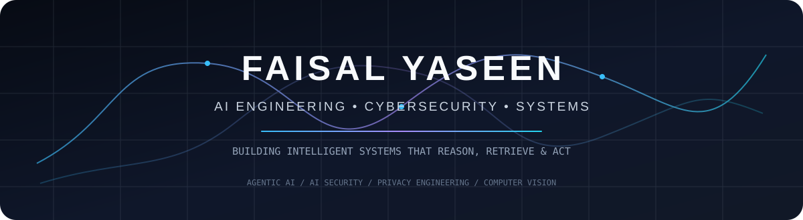
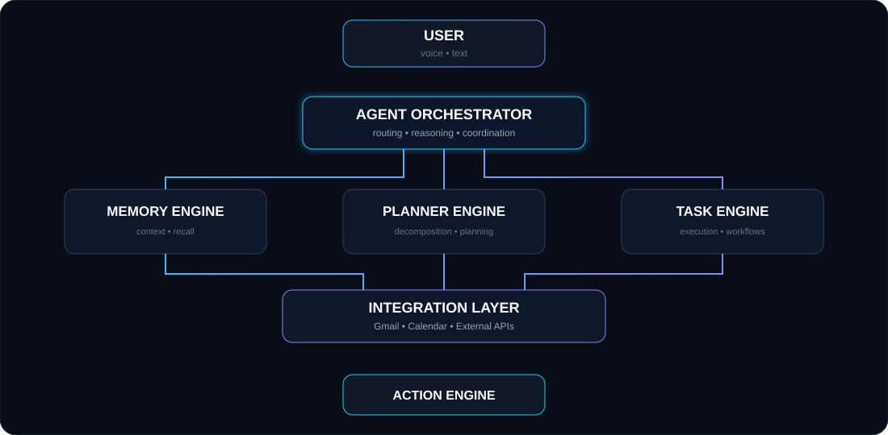
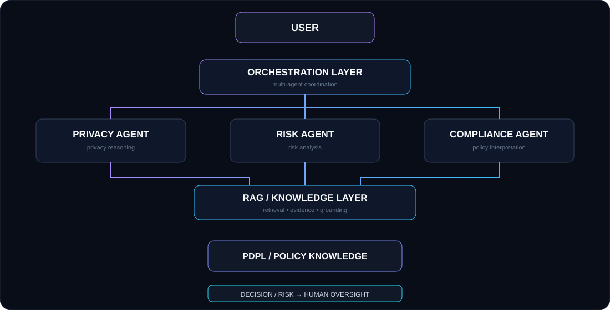
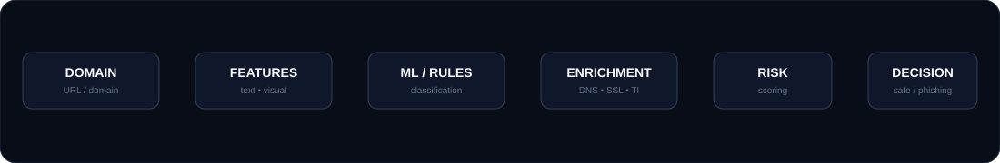
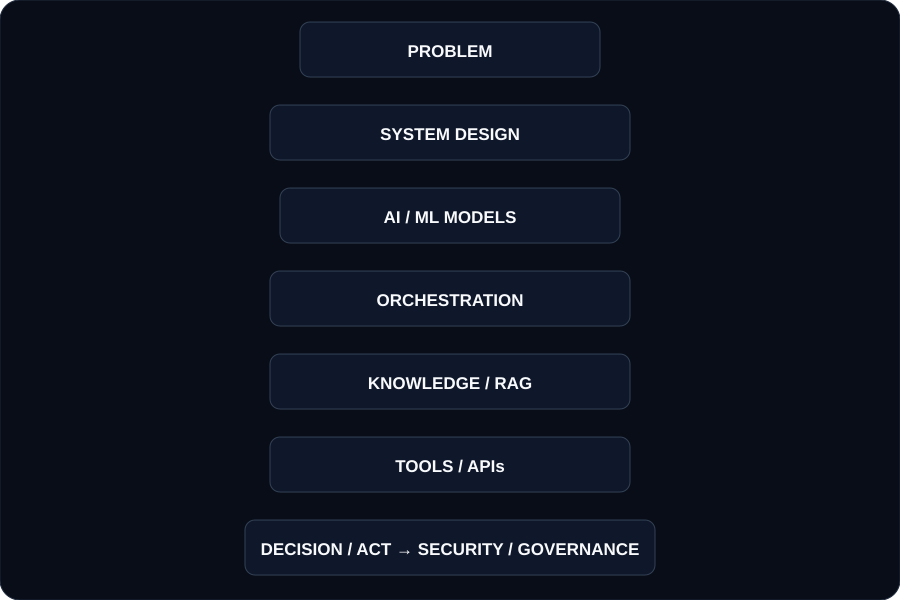
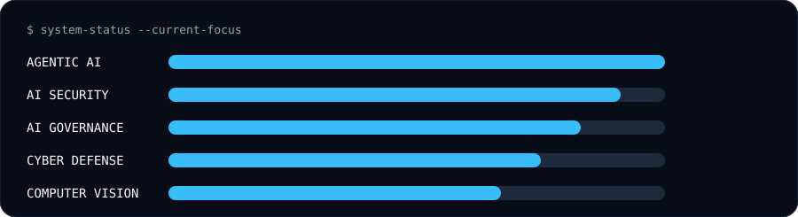
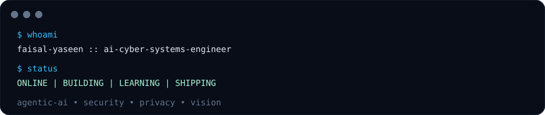

<!--
**faisalyaseen00/faisalyaseen00** is a ✨ _special_ ✨ repository because its `README.md` (this file) appears on your GitHub profile.
<div align="center">



<br/>

<a href="https://github.com/faisalyaseen00">
  
</a>
<a href="https://www.linkedin.com/in/faisal-yaseen-b0604a2b2/">
  
</a>

<br/><br/>


</div>

---

## 🧭 ENGINEERING FOCUS

I build systems at the intersection of **AI engineering, cybersecurity, privacy engineering, and computer vision**.

My interest is not limited to individual models. I focus on the engineering layer around them — **orchestration, memory, retrieval, tools, APIs, security controls, governance, and real-world execution**.

```text
AI MODEL  →  ORCHESTRATION  →  KNOWLEDGE / RAG  →  TOOLS / APIs  →  DECISION / ACTION
                                      │
                                      ▼
                              SECURITY + GOVERNANCE
```

---

# 🧠 LIYANA

### A Real-World Agentic AI System

**Liyana is my flagship AI system.**

The objective is not to build another question-answering chatbot. The system is being developed toward a **persistent agentic architecture** capable of understanding user context, maintaining useful memory, planning tasks, interacting with external services, and executing workflows.

<div align="center">

</div>

### System Direction

| Layer | Purpose |
|---|---|
| 🎙️ Voice + Text | Multi-modal user interaction |
| 🧠 Memory Engine | Persistent and useful context |
| 🧩 Planner Engine | Task decomposition and reasoning |
| ⚙️ Task Engine | Workflow execution |
| 🔌 Integration Layer | Gmail, Calendar and external APIs |
| 🚀 Action Engine | Turning decisions into real actions |

### Potential Evolution

**CURRENT**

`Voice + Text` · `Memory` · `Task Management` · `LLM Reasoning` · `External Integrations`

↓

**NEXT**

`More Autonomous Planning` · `Multi-Step Execution` · `Context-Aware Workflows` · `Personalized Behavior` · `Expanded Tool Ecosystem`

↓

**LONG-TERM**

`Persistent Personal Context` · `Multi-Agent Specialization` · `Proactive Assistance` · `Complex Workflow Automation` · `Intelligent Personal Operating Layer`

> **Status:** `PRIVATE • ACTIVE DEVELOPMENT`

---

# 🛡️ VDPO

### Virtual Data Protection Officer

VDPO is an **AI-native privacy and governance platform** under development.

The system is designed around a **multi-agent architecture**, where specialized agents reason over different aspects of privacy and compliance rather than relying on a single generic LLM response.

<div align="center">

</div>

### Engineering Direction

`Multi-Agent Orchestration` · `Specialized Privacy Reasoning` · `RAG` · `Saudi PDPL Knowledge` · `Privacy Risk Analysis` · `Compliance Assistance` · `Policy Interpretation` · `Evidence-Based Reasoning` · `Auditability` · `Human Approval Workflows` · `Cost-Aware Model Orchestration`

### Long-Term Potential

VDPO is being designed toward a broader **AI governance and privacy engineering platform**, capable of assisting organizations with:

- Privacy Impact Assessments
- Data processing analysis
- Privacy risk identification
- Compliance workflows
- Policy analysis
- Governance documentation
- Regulatory knowledge retrieval
- Evidence collection
- Continuous privacy monitoring
- Human-in-the-loop governance

> **Status:** `PRIVATE • UNDER DEVELOPMENT`

---

# 🛡️ PHISHING DOMAIN DETECTOR

### Machine Learning × Cybersecurity

A cybersecurity system designed to identify potentially malicious and phishing domains using **multi-layer machine-learning and security analysis**.

The public implementation combines visual similarity, textual analysis, SSL validation, WHOIS/DNS intelligence and threat intelligence rather than relying on a single detection technique.

<div align="center">

<a href="https://github.com/faisalyaseen00/Phishing-Domin-Detector">
  
</a>

<br/><br/>



</div>

### Engineering Focus

`Feature Engineering` · `ML Classification` · `Threat Detection` · `Visual Similarity` · `OCR` · `SSL Validation` · `WHOIS/DNS` · `Threat Intelligence` · `REST APIs`

> **Status:** `PUBLIC PROJECT`

---

# 🐕 REAL-TIME DOG BEHAVIOURAL ANALYSIS

### Computer Vision × Real-Time Intelligence

A real-time computer-vision system designed to analyze video streams and derive behavioural information from observed canine activity.

The project explores the transition from static image classification toward **continuous visual understanding of real-world behavior**.

```text
LIVE VIDEO
    │
    ▼
FRAME PROCESSING
    │
    ▼
VISUAL DETECTION
    │
    ▼
MOTION / POSTURE ANALYSIS
    │
    ▼
TEMPORAL BEHAVIOUR ANALYSIS
    │
    ▼
BEHAVIOURAL INSIGHT
```

### Engineering Areas

`Real-Time Video` · `Computer Vision` · `Object Detection` · `Behaviour Recognition` · `Temporal Analysis` · `Video Intelligence` · `Real-Time Inference`

> **Status:** `RESEARCH / DEVELOPMENT PROJECT`

---

# ⚙️ ENGINEERING DOMAINS

<div align="center">

<table>
<tr>
<td width="25%" align="center">

### 🛡️ CYBERSECURITY

Threat Detection  
Security Engineering  
Phishing Detection  
Security Automation

</td>
<td width="25%" align="center">

### 🤖 AI ENGINEERING

LLMs  
RAG  
Agentic AI  
Multi-Agent Systems

</td>
<td width="25%" align="center">

### 👁️ COMPUTER VISION

Real-Time Video  
Object Detection  
Behaviour Analysis  
Visual Intelligence

</td>
<td width="25%" align="center">

### ⚖️ AI GOVERNANCE

Privacy Engineering  
AI Governance  
Risk Analysis  
PDPL Compliance

</td>
</tr>
</table>

</div>

---

# 🧩 TECHNOLOGY STACK

<div align="center">

### AI / ML


`Machine Learning` · `LLMs` · `RAG` · `Embeddings` · `Vector Search` · `LangChain` · `LangGraph` · `Computer Vision` · `Real-Time Inference`

### Cybersecurity


`Threat Detection` · `Phishing Detection` · `Security Analysis` · `Network Security` · `Security Automation` · `Kali Linux` · `Wireshark` · `Nmap`

### Backend / Infrastructure


`Qdrant` · `SQLAlchemy` · `Alembic` · `REST APIs` · `Cloud Services`

### Engineering


</div>

---

# 🔬 HOW I APPROACH SYSTEMS

I am interested in building systems where AI is **not isolated inside a single model**.

My focus is the complete engineering pipeline:

<div align="center">

</div>

The objective is to build **systems that can reason, retrieve, act, and operate within defined constraints** rather than simply generate text.

---

# 🚀 CURRENT FOCUS

<div align="center">

</div>

### Current priorities

- Building production-oriented AI architectures
- Agent orchestration
- Memory-aware AI systems
- AI security
- Multi-agent governance
- Privacy engineering
- Real-time computer vision
- Intelligent cybersecurity systems

---

# 📌 PROJECT STATUS

| System | Domain | Status |
|---|---|---|
| 🧠 **Liyana** | Agentic AI | 🚧 Active Development |
| 🛡️ **VDPO** | AI Governance / Privacy | 🔒 Private / Under Development |
| 🛡️ **Phishing Domain Detector** | Cybersecurity / ML | 🟢 Public |
| 🐕 **Dog Behavioural Analysis** | Computer Vision | 🔬 Development |

---

# 📊 GITHUB

<div align="center">


</div>

---

# 🔗 CONNECT

<div align="center">

<a href="https://github.com/faisalyaseen00">
  
</a>
<a href="https://www.linkedin.com/in/faisal-yaseen-b0604a2b2/">
  
</a>
<a href="https://github.com/faisalyaseen00/Portfolio">
  
</a>

<br/><br/>



<br/>

### Building systems where AI meets security.

**Cybersecurity · AI Engineering · Agentic Systems · Computer Vision · AI Governance**

</div>
